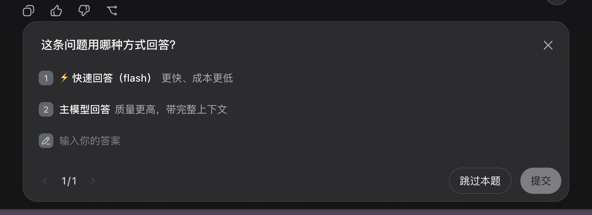
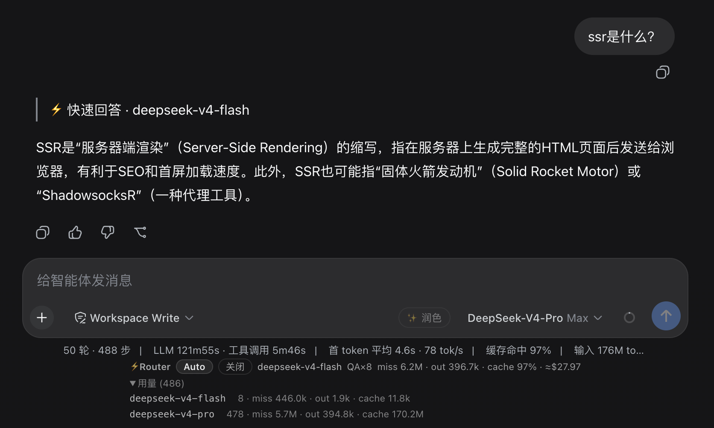

# dsh-model-router

[DeepSeek Harness](https://github.com/deepseek-ai/deepseek-harness)（`dsh`）的模型路由与成本优化插件。简单问题直接在便宜模型上作答（零前缀、无缓存税），瞬态故障自动降级，并在输入框下方实时显示每个会话的 token / 缓存命中 / 成本统计。

> Harness 目前处于 developer preview，迭代很快，可能有不兼容变更。

> For English, see [README.md](README.md)。

## 功能

- **便宜模型裁判路由** — 明显重活（强关键词 / 超长文本）直接走主模型，零额外延迟。其余请求交给一次**零前缀 flash 裁判调用**（`SIMPLE` / `AGENTIC` 一个词，64 token 上限，关闭思考）。裁判还会看到上一条 assistant 回复，因此依赖上下文的追问（它 / 这个 / 继续 …）绝不会被误判成"无上下文作答"。
- **回答前先问用户** — auto 模式下，每次命中 SIMPLE 都会通过内置问题 UI 询问：**⚡ 快速回答（flash）** 还是 **主模型回答**。选主模型（或关掉弹窗）走正常流程；子代理会话自动回退。问题文案跟随提问语言。
- **直答式快速回答** — 用户选快速后，插件拒绝该步骤，用**零前缀单次流式调用**在便宜模型上作答（无缓存 miss 税），并把问答直接写入会话日志（伪造 step 包络）——用户看到的是普通问答，答案前缀带 `⚡ 快速回答 / Quick answer · <model>` 标记（随提问语言），主模型零参与，**不产生子代理会话、relay 卡片或 toast**。主会话的模型和前缀缓存全程不受影响。
- **Auto / 关闭 开关** — 面板按钮和 `/router auto|off`（以及 `route_model` 工具）只做一件事：开启或关闭本会话的快速回答。没有需要配置的按请求模型切换。
- **自动降级** — 瞬态故障（`RATE_LIMIT` / `SERVER` / `TIMEOUT` / `EMPTY_RESPONSE`）把该轮降级到便宜模型并重试一次；其余交给 provider 自带的重试策略。
- **真实用量计量** — 会话投影折叠持久化日志：真实适配器 token 用量（输入 / 输出 / 缓存读 / 缓存写 / 推理）、分模型明细、按模型档位价格表估算的成本。投影可重放、冷会话也能出数。
- **输入框面板（中英双语）** — Auto / 关闭 开关、当前模型、`miss/out/cache%/≈$` 行、`QA×N` 快速回答计数（每次直答有短暂内联高亮）、分模型用量明细。读数据走 `useProjection`（响应式，无 RPC）；开关复用内置 `commands` remote。UI 文案经 harness `locale` 服务中英本地化。

## 截图

快速回答以普通对话消息形式呈现，带 `⚡ 快速回答 / Quick answer` 标记：



输入框下方的路由面板 —— Auto / 关闭 开关、当前模型、实时 token / 缓存命中 / 成本统计与分模型用量明细：



## 安装

### 前置条件

`dsh` CLI 必须在 `PATH` 上。如果你之前只用 `npx` 跑过 harness，`dsh` 没装，会报 `zsh: command not found: dsh` —— 先全局安装：

```sh
npm install -g @deepseek-ai/dsh
```

如果你的 pnpm 全局 bin 目录在 `PATH` 上，`pnpm add -g @deepseek-ai/dsh` 也可以（否则 pnpm 会让你先跑 `pnpm setup`）。或者跳过全局安装，把下面命令都加 `npx @deepseek-ai/dsh` 前缀。

### 添加 bundle

```sh
# 1. 把 bundle 加入你的 web profile（pnpm 执行；lib/ 产物已提交在仓库里，
#    安装时不跑构建脚本）。推荐用 release tag（#v0.7.2）；#main 跟随最新提交。
dsh plugin --profile web add "github:tianji-qingtian/dsh-model-router#v0.7.2"

# 2. 用该 profile 重启 harness —— add 只改 profile 文件，
#    运行中的实例不会热加载新 bundle
dsh --profile web
```

重启后 ⚡Router 面板出现在输入框下方，`/router` 命令和 `route_model` 工具随宿主半场加载注册。可在 Settings → Plugins 里确认 `dsh-model-router` 已列出。

> 某个会话里可能还跑着一个同名的动态原型（session-local）；它与安装的 bundle 无关，随 harness 进程消失。

## 工作原理

| 环节 | 机制 |
| --- | --- |
| 步骤分类 | `agent/pre-step` 瀑布 —— 强关键词快速通道，之后是一次零前缀 flash 裁判调用（SIMPLE / AGENTIC），并带上一条 assistant 回复用于引用检测 |
| 快速回答 | `agent/pre-step` 在便宜模型上跑一次零前缀 `llm.stream` 后拒绝该步骤；问答以 `user/message` + 伪造 `step/start`…`assistant/message`…`step/end` 包络写入会话日志 —— 主模型零参与 |
| 漂移修复 | `agent/request` 在无路由决策时把模型拉回 agent 配置默认值（伪造 header 或重启后的陈旧持久化 header 不会粘住） |
| 故障降级 | `agent/request-error` 瀑布 —— 标记该轮后返回 `{ kind: 'retry' }`；重试重新进入 `agent/request` 落到便宜模型 |
| 统计 | `sessionProjections.register('modelRouter', …)` 折叠 `request/header`、`command/run`、`assistant/message` 事件（用量 + `mrtr-ans-` 快速回答） |
| 面板 UI | `conversation.composer.dock` 槽位 + 标准 `useProjection` prop + `locale` 服务中英文案 |
| 手动控制 | `/router auto|off` 命令（`commands` 服务）+ `route_model` 工具（`tools` 注册表） |

便宜/强模型对在运行时从 provider 目录发现（`llm.listModels`）：id 匹配 `flash|chat|mini|turbo|haiku|lite|air|nano` 是便宜候选，`pro|reasoner|opus|sonnet|max|ultra|premium|r1` 是强候选。原生 DeepSeek 适配器下即 `deepseek-v4-flash` ↔ `deepseek-v4-pro`。

## 成本估算

价格表是模型档位估算（USD / 百万 token），在 [`src/index.js`](src/index.js) 顶部：

```js
const PRICE_TABLE = [
  { test: CHEAP_RE, input: 0.27, output: 1.10, cacheHit: 0.07 },
  { test: STRONG_RE, input: 0.55, output: 2.19, cacheHit: 0.14 },
]
```

改成你账户的实际价格即可；面板始终用 `≈` 标注。缓存命中按缓存价计费，而非输入价。

**计数语义**：harness 的 `TokenUsage` 字段是*不相交*的 —— `inputTokens` 已排除缓存读（DeepSeek 上报 `prompt_tokens = hit + miss`，适配器把命中扣掉了）。因此面板显示 `miss … · cache N%`，命中率是 `hit / (hit + miss)`；健康的长对话通常在 90% 以上。

## 已知限制

- 路由状态分两部分：auto/off 模式是**持久**的（由投影从会话 `command/run` 事件折叠，重启后保持），瞬态降级标记是进程本地的，随 harness 重置。
- `useProjection` 驱动的统计反映整段会话日志 —— 安装前的历史也会计入，这是有意的。
- 直答会把伪造 step 包络（外加一条 `request/header` 用于归因）写进会话日志。它满足当前会话不变量（步骤在真实 step 开始前追加），但这是插件与 harness 耦合最深的部分，harness 升级后值得复查。

## License

MIT
